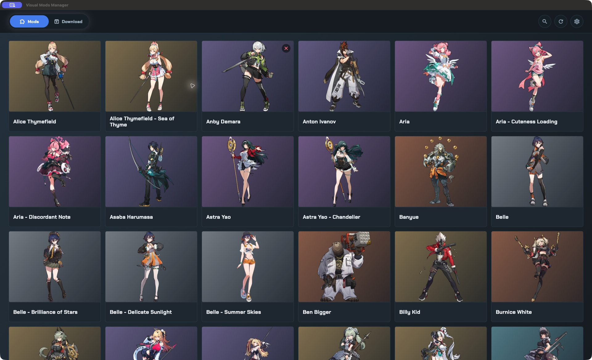
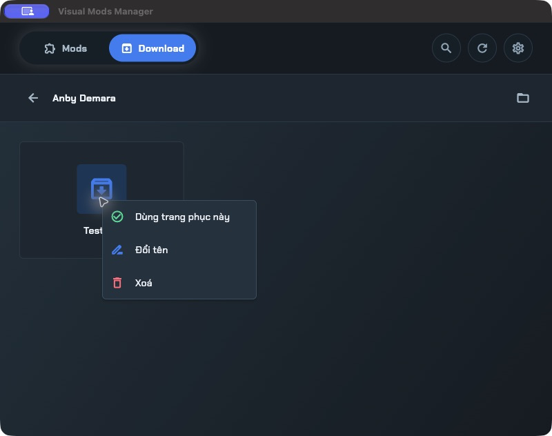

# Visual Mods Manager

Visual Mods Manager giúp bạn sắp xếp và cài đặt mod trang phục cho **Zenless Zone Zero** trên Windows.

## Cài đặt

1. Mở trang [Releases](https://github.com/DevMobileAn27/visual-mods-manager/releases).
2. Tải `Visual-Mods-Manager-Setup.exe`.
3. Chạy bộ cài và làm theo hướng dẫn trên màn hình.

## Thiết lập lần đầu

Khi mở ứng dụng lần đầu:

1. Ở **Thư mục Mods**, chọn nơi bạn lưu các mod đã cài.
2. Ở **Thư mục Download**, chọn nơi chứa các file ZIP mod.
   - Chọn thư mục có sẵn, hoặc
   - Chọn **Tạo mới** để tạo thư mục mới.
3. Bấm **Bắt đầu quản lý**.

Nên đặt hai thư mục này bên ngoài thư mục cài đặt ứng dụng để dữ liệu vẫn được giữ nguyên khi cập nhật app.

## Duyệt mod

- Chọn tab **Mods** để xem các mod đã cài.
- Chọn tab **Download** để xem các file ZIP đã tải.
- Bấm vào ô nhân vật hoặc trang phục để xem nội dung bên trong.
- Dùng biểu tượng kính lúp để tìm kiếm.
- Bấm biểu tượng làm mới sau khi thêm hoặc xóa file bằng File Explorer.
- Bấm biểu tượng thư mục trong màn hình chi tiết để mở vị trí tương ứng trên máy.

## Cài đặt trang phục

1. Tải file ZIP trang phục và đặt vào thư mục trang phục tương ứng trong tab **Download**.
2. Mở ô trang phục đó.
3. Bấm chuột phải vào file ZIP.
4. Chọn **Dùng trang phục này**.
5. Chuyển sang tab **Mods** để xem mod đã cài.

Bạn cần tự tải file ZIP trước; ứng dụng không tự tải mod từ Internet.

## Xóa mod hoặc file ZIP

1. Mở thư mục hoặc trang phục cần chỉnh sửa.
2. Bấm chuột phải vào file hoặc thư mục.
3. Chọn **Xóa** rồi xác nhận.

> Lệnh xóa tác động trực tiếp lên ổ đĩa và không chuyển file vào Thùng rác.

## Đổi thư mục

1. Bấm biểu tượng **Settings**.
2. Chọn **Change** tại mục **Mods** hoặc **Download**.
3. Chọn thư mục mới.

Thay đổi có hiệu lực ngay sau khi chọn.

## Cập nhật ứng dụng

- Ứng dụng tự kiểm tra bản mới khi khởi động.
- Bạn có thể kiểm tra thủ công tại **Settings → Kiểm tra cập nhật**.
- Khi có bản mới, làm theo hướng dẫn tải và cài đặt.

Nếu danh sách chưa thay đổi sau khi chỉnh sửa thư mục, hãy bấm biểu tượng **Làm mới**.
