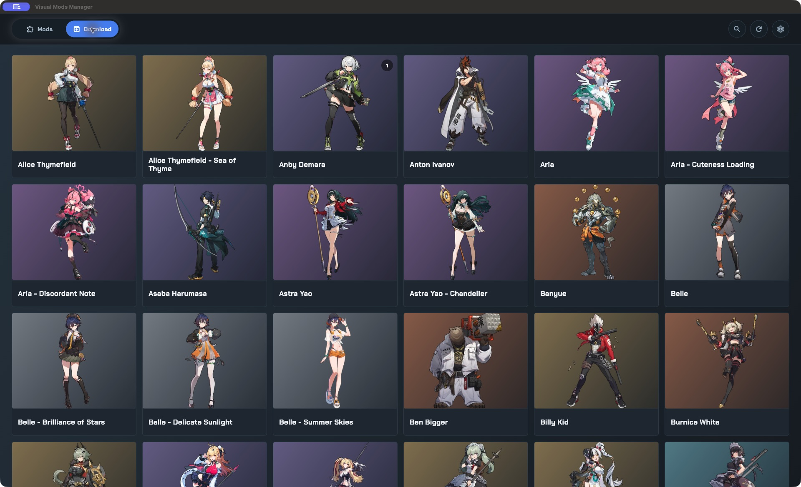
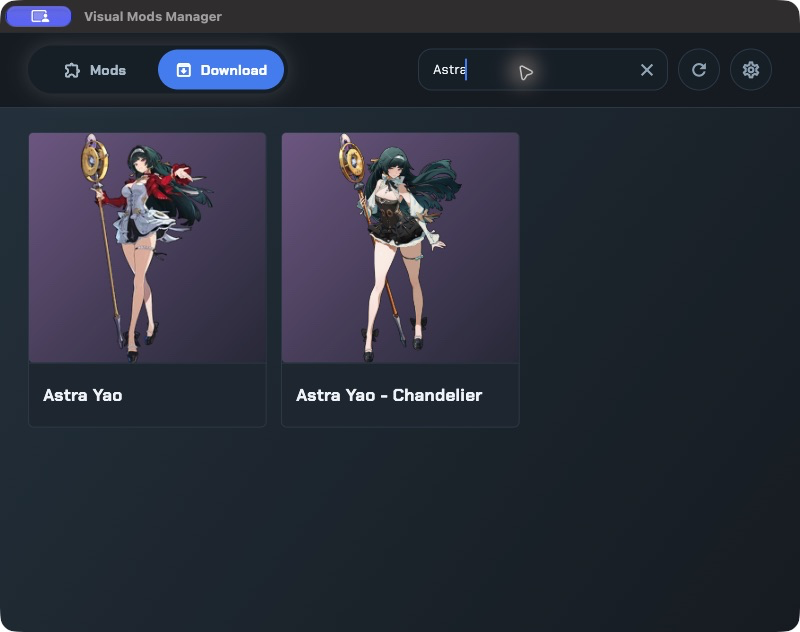
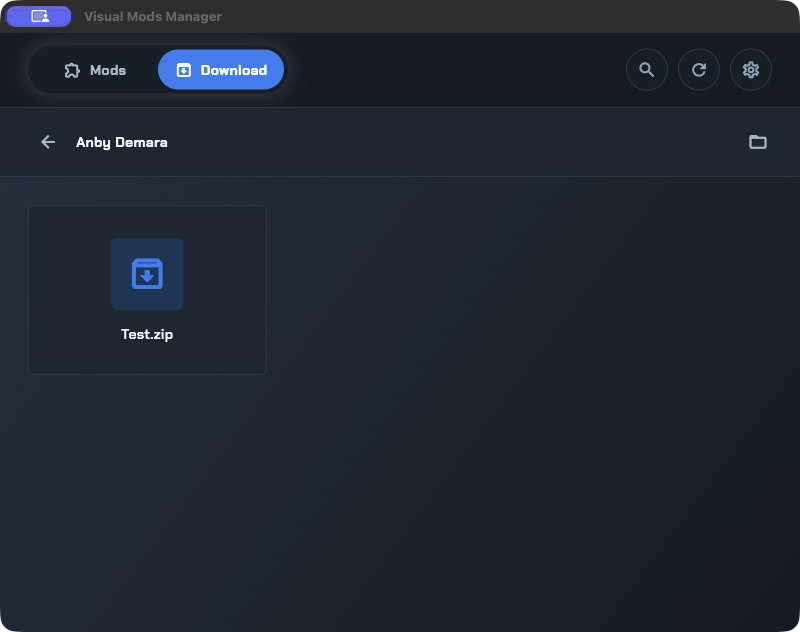
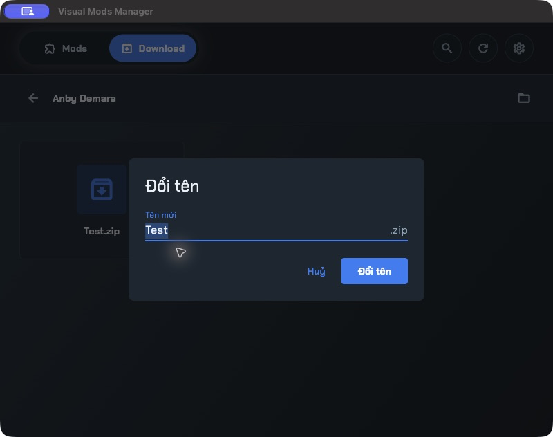
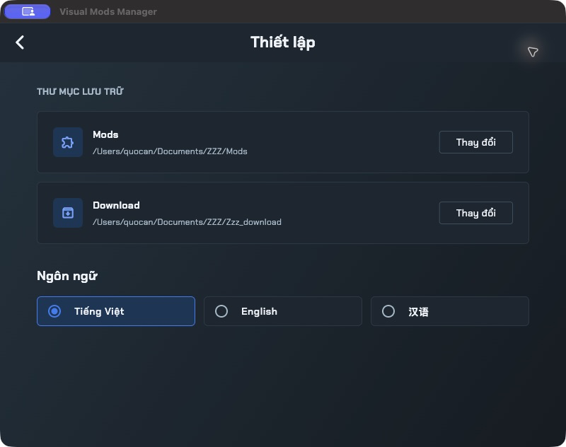

# Visual Mods Manager

Visual Mods Manager giúp bạn sắp xếp và cài đặt mod trang phục cho **Zenless Zone Zero** trên Windows.

## Cài đặt

1. Mở trang [Releases](https://github.com/DevMobileAn27/visual-mods-manager/releases).
2. Tải `Visual-Mods-Manager-Setup.exe`.
3. Chạy bộ cài và làm theo hướng dẫn trên màn hình.

## Thiết lập lần đầu

Khi mở ứng dụng lần đầu:

1. Ở **Thư mục Mods**, chọn nơi bạn lưu các mod đã cài.
2. Ở **Thư mục Download**, chọn nơi chứa các file ZIP hoặc RAR mod.
   - Chọn thư mục có sẵn, hoặc
   - Chọn **Tạo mới** để tạo thư mục mới.
3. Bấm **Bắt đầu quản lý**.

Nên đặt hai thư mục này bên ngoài thư mục cài đặt ứng dụng để dữ liệu vẫn được giữ nguyên khi cập nhật app.

## Duyệt mod

- Chọn tab **Mods** để xem các mod đã cài.
- Chọn tab **Download** để xem các file ZIP hoặc RAR đã tải.
- Bấm card ở **Mods** để mở chi tiết mod; bấm card ở **Download** để mở chi tiết download.
- Dùng biểu tượng kính lúp để tìm kiếm.
- Bấm biểu tượng làm mới sau khi thêm hoặc xoá file bằng File Explorer, kể cả khi đang ở màn hình chi tiết.
- Bấm biểu tượng thư mục trong màn hình chi tiết để mở vị trí tương ứng trên máy.

Số trên card **Download** cho biết số file ZIP/RAR. Hover vào dấu trạng thái trên card **Mods** để xem thông tin.

### Tìm kiếm

Hover hoặc bấm kính lúp, rồi nhập tên nhân vật hoặc trang phục. Bấm **X** để xoá từ khoá.

## Cài đặt trang phục

1. Trong tab **Download**, mở card trang phục muốn cài.
2. Bấm biểu tượng thư mục để mở vị trí lưu file, rồi đặt file ZIP/RAR đã tải vào đó.
3. Quay lại app, bấm **Làm mới**.
4. Bấm chuột phải vào file ZIP/RAR, chọn **Dùng trang phục này**.
5. Chờ giải nén hoàn tất, rồi chuyển sang tab **Mods** để xem mod đã cài.

## Menu chuột phải

Bấm chuột phải vào file hoặc thư mục **bên trong màn hình chi tiết** để mở menu.

| Lựa chọn | Chức năng |
| --- | --- |
| **Dùng trang phục này** | Giải nén và cài mod; chỉ xuất hiện với ZIP/RAR trong Download. |
| **Đổi tên** | Đổi tên file hoặc thư mục. |
| **Xoá** | Xoá file hoặc thư mục sau khi xác nhận. |

### Đổi tên

1. Chọn **Đổi tên** trong menu chuột phải.
2. Nhập tên mới rồi bấm **Đổi tên** hoặc nhấn **Enter**.

Chỉ nhập tên mới; đuôi file được giữ nguyên.

## Xóa mod hoặc file ZIP/RAR

1. Mở thư mục hoặc trang phục cần chỉnh sửa.
2. Bấm chuột phải vào file hoặc thư mục.
3. Chọn **Xoá** rồi xác nhận.

> Lệnh xóa tác động trực tiếp lên ổ đĩa và không chuyển file vào Thùng rác.

## Thiết lập

1. Bấm biểu tượng bánh răng ở bên phải thanh tab để mở **Thiết lập**.
2. Chọn **Thay đổi** tại mục **Mods** hoặc **Download**.
3. Chọn thư mục mới.

Thay đổi có hiệu lực ngay sau khi chọn.

Ở mục **Ngôn ngữ**, chọn **Tiếng Việt**, **English** hoặc **汉语**.

## Cập nhật ứng dụng trên Windows

1. Mở **Thiết lập → Cập nhật ứng dụng → Kiểm tra cập nhật**.
2. Khi có bản mới, làm theo hướng dẫn tải và cài đặt.

## Giấy phép

Visual Mods Manager được phát hành theo [GNU General Public License v3.0 (GPL-3.0)](LICENSE).
